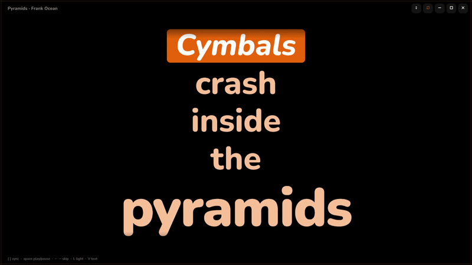
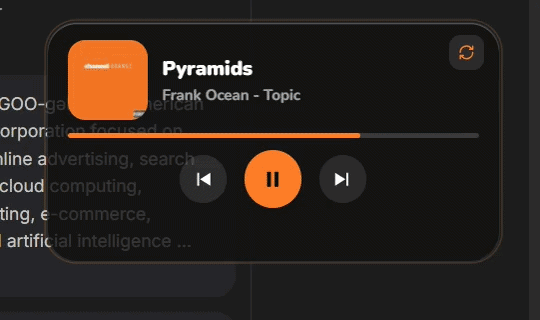

<div align="center">

# Lyriscence

**Kinetic, synced lyrics for Windows, wrapped in a glow that matches your music.**


</div>

---

> ⚠️ **Heads up: this project is vibecoded.**
> Lyriscence was built with AI assistance as a personal learning project and a bit of creative fun. It's not production software, it hasn't been audited or heavily tested, and there are no guarantees. Expect rough edges. Use it, fork it, learn from it, but don't rely on it for anything serious.

---


## What is it?

Lyriscence reads whatever is currently playing on your PC (Spotify desktop, YouTube in a browser, and so on) through the Windows media session, fetches time-synced lyrics from [LRCLIB](https://lrclib.net), and shows them as a vertical stack of bold, animated typography. The lyrics window is wrapped in a moving glow coloured from the album art, and a separate glass player card gives you playback controls.

<p align="center">
  
  
</p>

## Features

- **Works with any player**: anything that reports to the Windows media controls.
- **Time-synced lyrics** from LRCLIB, highlighted line by line as the song plays.
- **Album-coloured border light**: a soft stream of light travels around the window and card, fading in and out like car ambient lighting.
- **Smart fallback colours**: if a song has no usable art, it gets its own hue derived from the title and artist (and the mood of the lyrics).
- **Glass player card** with previous / play-pause / next.
- **Light mode** and **vertical / horizontal** text layouts.
- **Manual sync nudging** when lyrics are slightly off.


## How it works

```
┌────────────────────┐   JSON    ┌─────────────────────┐   HTTPS   ┌──────────┐
│ helper/media.py    │ ────────► │ app/ (Electron)     │ ────────► │  LRCLIB  │
│ Windows media      │ ◄──────── │ lyrics window +     │ ◄──────── │ lyrics   │
│ session (winrt)    │  controls │ glass player card   │           │ API      │
└────────────────────┘           └─────────────────────┘           └──────────┘
```

- `helper/`: a small Python script that talks to the Windows media session (track info, album art, position, play/pause/skip).
- `app/`: the Electron front end that fetches lyrics and renders everything.

## Requirements

- Windows 10 or 11
- [Python 3.10+](https://www.python.org/downloads/) (tick **Add to PATH** during install)
- [Node.js LTS](https://nodejs.org/)

## Setup

1. Clone the repo:
   ```bash
   git clone https://github.com/CeeeGee/Lyriscence.git
   cd Lyriscence
   ```
2. Double-click **`install.bat`** (installs the Python and npm dependencies).
3. Start playing a song.
4. Double-click **`start.bat`**.

To check that the media helper works on its own, run `helper\test_helper.bat`. It should print info about whatever is playing.

## Controls

| Input | Action |
|---|---|
| Glass card buttons | Previous / play-pause / next |
| Window buttons | Minimise, maximise, close |
| Bottom-right grip | Drag to resize |
| `Space` | Play / pause |
| `←` `→` | Previous / next track |
| `[` `]` | Nudge lyric sync earlier / later |
| `F` | Maximise |
| `L` | Cycle border light (moving / stationary / off) in the lyrics window |
| `V` | Toggle vertical / horizontal text |

### Border light

A button on the glass card (top-right) and one in the lyrics window's title buttons cycle the light between **moving**, **stationary** (an even glow all the way round) and **off**. Each window remembers its own choice.

## Project structure

```
Lyriscence/
├── app/                 # Electron app
│   ├── main.js          # main process, LRCLIB fetching, mood/hue logic
│   ├── preload.js       # IPC bridge
│   ├── renderer.js      # lyrics rendering and sync
│   ├── glow.js          # animated border light
│   ├── lightning.js     # border light wiring for the lyrics window
│   ├── theme.js         # colour / theme handling
│   ├── index.html       # lyrics window
│   ├── card.html        # glass player card
│   ├── style.css
│   └── package.json
├── helper/              # Python media-session helper
│   ├── media.py
│   ├── requirements.txt
│   └── test_helper.bat
├── docs/                # demo GIFs
├── install.bat
├── start.bat
├── LICENSE
└── README.md
```

## Known limitations

- Windows only (it relies on the Windows media session API).
- Lyrics depend on LRCLIB having a synced entry for the song. Obscure tracks may have none.
- Sync quality depends on what the player reports; use `[` and `]` to correct it.
- Vibecoded, so bugs are expected.

## Credits

- Lyrics: [LRCLIB](https://lrclib.net)
- Font: [Nunito](https://fonts.google.com/specimen/Nunito) (Google Fonts)
- Built with [Electron](https://www.electronjs.org/) and [winrt](https://github.com/pywinrt/pywinrt)
- Written with a lot of help from AI

## Disclaimer

This is a personal, non-commercial learning project. It is not affiliated with Spotify, YouTube, LRCLIB or any lyrics provider. Lyrics belong to their respective rights holders and are fetched on demand from LRCLIB, not stored or redistributed by this project.

## License

[MIT](LICENSE)
